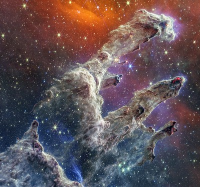
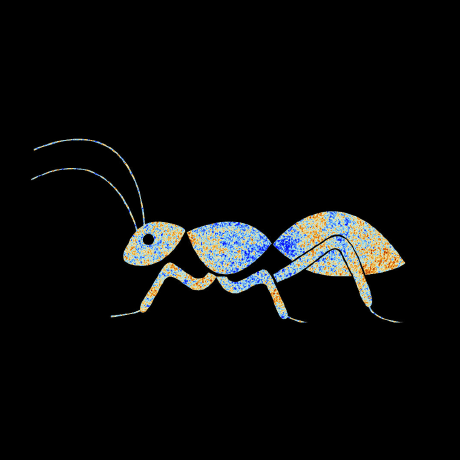
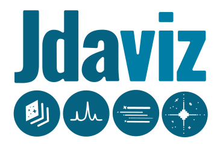
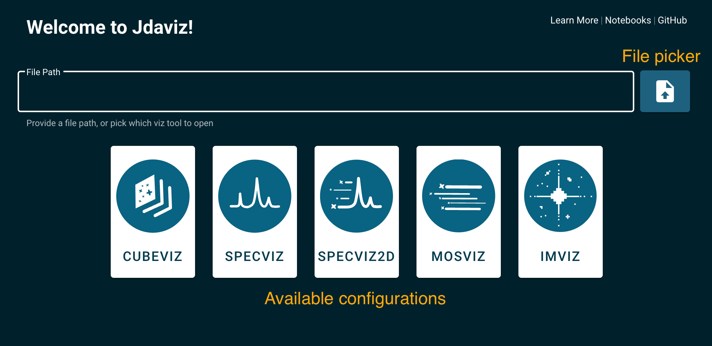

<em>Pillars of Creation (NIRCam and MIRI Composite Image). Image Credit: NASA, ESA, CSA, and STScI</em>

# Shivaji - Astronomical Software Tools
## Table of Contents
- [ Python Tools](#python-tools)
    - [Astropy](#astropy)
    - [AstroML](#AstroMl)
    - [Astroquery](#astroquery)
    - [Camb](#camb)
    - [Cobaya](#cobaya)
    - [GASTLI](#GASTLI)
    - [H5py](#h5py)
    - [Healpy](#healpy)
    - [Jdaviz](#jdaviz)
    - [Lightkurve](#lightkurve)
    - [PyCBC](#pycbc)
    - [Spectral-cube](#spectral-cube)
    - [HEAsoft](#heasoft)
- [ Executable Software](#executable-software)
   - [Aladin](#aladin)
   - [AstroImageJ](#AstroImageJ)
   - [SAOImageDS9](#SAOImageDS9)
   - [TOPCAT](#topcat)
   - [SExtractor](#sextractor)

---

## Python Tools

### Astropy

----

Astropy is a comprehensive library designed to support the core functionality needed for astronomy and astrophysics research. It provides a wide range of tools that are essential for astronomers, including celestial coordinate transformations, time and date handling, unit conversions, and data manipulation. 

One of the key strengths of Astropy is its ability to handle various astronomical file formats, making it easier for researchers to read and write data. Additionally, it offers modules for performing statistical analysis and visualizing data, which are crucial for interpreting astronomical observations.

For more information and to get started with Astropy, visit their [official website](https://www.astropy.org).

- **Installation**: [Install Astropy](https://docs.astropy.org/en/stable/install.html#installing-astropy)
- **Pip Installation**: `pip install astropy`
- **Source Code**: [GitHub Repository](https://github.com/astropy/astropy)
- **Tutorials**: [Learn Tutorials](https://learn.astropy.org/)
- **API Reference**: [Astropy API](https://docs.astropy.org/en/stable/index_user_docs.html)

### AstroML

----

AstroML is a Python module for machine learning and data mining built specifically for astronomy. It contains a growing library of statistical and machine learning routines for analyzing astronomical data in a variety of formats. The library is designed to be flexible and easy to use, making it a valuable tool for both researchers and educators.

AstroML includes tools for data preprocessing, feature selection, regression, classification, clustering, and more. It also provides a collection of example datasets and scripts to help users get started quickly.

For more information and to get started with AstroML, visit their [official website](https://www.astroml.org).

- **Installation**: [Install AstroML](https://www.astroml.org/user_guide/installation.html)
- **Source Code**: [GitHub Repository](https://github.com/astroML/astroML)
- **Pip Installation**: `pip install astroML`
- **Tutorials**: [AstroML Tutorials](https://www.astroml.org/examples/index.html)
- **Books**: [AstroML Interactive Book](https://www.astroml.org/astroML-notebooks/)
- **Additional Resources**: [Textbook Figures](https://www.astroml.org/book_figures/)
- **API Reference**: [AstroML API](https://www.astroml.org/modules/classes.html)

### Astroquery

----

Astroquery is a Python package that provides a simple interface for querying astronomical databases and archives. It allows users to access a wide range of data sources, including NASA's archives, the European Space Agency's archives, and many others. The library is designed to be easy to use, with a consistent API that simplifies the process of querying and retrieving data.

Astroquery supports a variety of query types, including cone searches, image searches, and spectral searches. It also provides tools for handling the returned data, making it easier to integrate into your analysis workflows.

For more information and to get started with Astroquery, visit their [official website](https://astroquery.readthedocs.io).

- **Installation**: `pip install astroquery`
- **Tutorials**: [Astroquery Tutorials](https://astroquery.readthedocs.io/en/latest/index.html#using-astroquery)
- **API Reference**: [Astroquery API](https://astroquery.readthedocs.io/en/latest/genindex.html)
- **Source Code**: [GitHub Repository](https://github.com/astropy/astroquery)
- **Python module Index**: [Useful API](https://astroquery.readthedocs.io/en/latest/py-modindex.html)

### Camb

----

Camb (Code for Anisotropies in the Microwave Background) is a cosmology library for calculating theoretical predictions for the cosmic microwave background (CMB) and matter power spectra. It is widely used in the field of cosmology for analyzing data from CMB experiments and large-scale structure surveys.

Camb provides tools for computing the CMB power spectra, matter power spectra, and other related quantities. It is highly configurable, allowing users to specify various cosmological parameters and models.

For more information and to get started with Camb, visit their [official website](https://camb.info).

- **Installation**: `pip install camb`
- **Source Code**: [GitHub Repository](https://github.com/cmbant/CAMB)
- **Documentation**: [Camb Documentation](https://camb.readthedocs.io/en/stable/)
- **Examples**: [Camb Examples Notebook](https://camb.readthedocs.io/en/latest/CAMBdemo.html)
- **API Reference**: [Camb API](https://camb.readthedocs.io/en/stable/genindex.html)

### Cobaya

----

Cobaya (Code for Bayesian Analysis) is a framework for sampling and statistical modeling, designed for cosmological parameter estimation. It allows users to define complex models and perform Bayesian inference using various sampling algorithms.

Cobaya is highly modular and can interface with other cosmological codes, such as CAMB and CLASS, to compute theoretical predictions. It also supports parallel computation, making it efficient for large-scale analyses.

For more information and to get started with Cobaya, visit their [official website](https://cobaya.readthedocs.io).

- **Installation**: [`pip install cobaya`](https://cobaya.readthedocs.io/en/latest/installation.html)
- **Source Code**: [GitHub Repository](https://github.com/CobayaSampler/cobaya)
- **Documentation**: [Cobaya Documentation](https://cobaya.readthedocs.io/en/latest/)
- **Examples**: [Cobaya Examples](https://cobaya.readthedocs.io/en/latest/example.html)
- **API Reference**: [Cobaya API](https://cobaya.readthedocs.io/en/latest/py-modindex.html)

### Dustpy

----

Dustpy is a Python package for simulating the evolution of dust in protoplanetary disks. It provides tools for modeling the growth, fragmentation, and dynamics of dust particles in these environments.

Dustpy is designed to be flexible and user-friendly, with a range of options for customizing simulations. It is particularly useful for studying the processes that lead to planet formation.

For more information and to get started with Dustpy, visit their [official website](https://stammler.github.io/dustpy/).

- **Installation**: `pip install dustpy`
- **Source Code**: [GitHub Repository](https://github.com/stammler/dustpy)
- **Documentation**: [Dustpy Documentation](https://stammler.github.io/dustpy/index.html#dustpy-documentation)
- **Examples**: [Dustpy Basic Usages](https://stammler.github.io/dustpy/1_basics.html)
- **API Reference**: [Dustpy API](https://stammler.github.io/dustpy/api.html)

### GASTLI

----

GASTLI (Galactic and Stellar Light) is a Python package for simulating and analyzing the light from galaxies and stars. It provides tools for generating synthetic photometry, modeling stellar populations, and fitting observed data.

GASTLI is designed to be flexible and user-friendly, with a range of options for customizing simulations and analyses. It is particularly useful for studying the properties of galaxies and their stellar populations.

For more information and to get started with GASTLI, visit their [official website](https://gastli.readthedocs.io).

- **Installation**: [gastli install](https://gastli.readthedocs.io/en/latest/installation.html)
- **Source Code**: [GitHub Repository](https://github.com/gastli/gastli)
- **Documentation**: [GASTLI Documentation](https://gastli.readthedocs.io/en/latest/)
- **Tutorials**: [GASTLI tutorials](https://gastli.readthedocs.io/en/latest/tutorial.html)
- **API Reference**: [GASTLI API](https://gastli.readthedocs.io/en/latest/autoapi/index.html)

### H5py

----

H5py is a Python interface to the HDF5 binary data format, which is widely used in scientific computing for storing large datasets. It allows users to read and write HDF5 files, providing a flexible and efficient way to manage complex data.

H5py supports a range of data types and structures, making it suitable for a variety of applications, including astronomy. It also integrates well with other scientific libraries, such as NumPy and SciPy.

For more information and to get started with H5py, visit their [official website](https://www.h5py.org).

- **Installation**: `pip install h5py`
- **Source Code**: [GitHub Repository](https://github.com/h5py/h5py)
- **Documentation**: [H5py Documentation](https://docs.h5py.org/en/stable/)
- **Examples**: [H5py Examples](https://docs.h5py.org/en/stable/quick.html)
- **API Reference**: [H5py API](https://docs.h5py.org/en/stable/genindex.html)
- **BOOKS**:
    - [O'Reilly book, Python and HDF5, written by the lead author of h5py, Andrew Collette](http://shop.oreilly.com/product/0636920030249.do)

### Healpy

----

Healpy is a Python package for working with HEALPix (Hierarchical Equal Area isoLatitude Pixelation) data, which is commonly used in astronomy for analyzing spherical data, such as maps of the cosmic microwave background.

Healpy provides tools for creating, manipulating, and visualizing HEALPix maps. It also includes functions for performing spherical harmonic transforms and other operations on spherical data.

For more information and to get started with Healpy, visit their [official website](https://healpy.readthedocs.io).

- **Installation**: `pip install healpy`
- **Source Code**: [GitHub Repository](https://github.com/healpy/healpy)
- **Documentation**: [Healpy Documentation](https://healpy.readthedocs.io/en/latest/)
- **Tutorials**: [Healpy tutorial](https://healpy.readthedocs.io/en/latest/tutorial.html)
- **API Reference**: [Healpy API](https://healpy.readthedocs.io/en/latest/genindex.html)

### Jdaviz

----

----

Jdaviz is a suite of interactive data visualization tools for astronomy, built on the Jupyter platform. It provides a range of applications for visualizing and analyzing different types of astronomical data, including spectra, images, and cubes.

Jdaviz is designed to be user-friendly and highly customizable, with a focus on interactive exploration and analysis. It integrates with other scientific libraries, such as Astropy and Specutils, to provide a seamless workflow for astronomers.

For more information and to get started with Jdaviz, visit their [official website](https://jdaviz.readthedocs.io).

- **Installation**: [`pip install jdaviz`](https://jdaviz.readthedocs.io/en/stable/installation.html)
- **Source Code**: [GitHub Repository](https://github.com/spacetelescope/jdaviz)
- **Documentation**: [Jdaviz Documentation](https://jdaviz.readthedocs.io/en/latest/)
- **Tutorials**: [Jdaviz video tutorials](https://jdaviz.readthedocs.io/en/stable/video_tutorials.html) [jdaviz example notebook](https://jdaviz.readthedocs.io/en/stable/sample_notebooks.html#sample-notebook)
- **API Reference**: [Jdaviz API](https://jdaviz.readthedocs.io/en/stable/reference/api.html)

### Lightkurve

----

Lightkurve is a Python package for analyzing time series data from NASA's Kepler and TESS missions. It provides tools for working with light curves, including functions for reading, manipulating, and visualizing the data.

Lightkurve is designed to be easy to use, with a focus on enabling quick and efficient analysis of time series data. It also includes tools for detecting and characterizing exoplanets, making it a valuable resource for researchers in the field of exoplanet science.

For more information and to get started with Lightkurve, visit their [official website](https://docs.lightkurve.org).

- **Installation**: `pip install lightkurve`
- **Source Code**: [GitHub Repository](https://github.com/lightkurve/lightkurve)
- **Documentation**: [Lightkurve Documentation](https://docs.lightkurve.org)
- **Examples**: [Lightkurve Examples](https://docs.lightkurve.org/tutorials.html)
- **API Reference**: [Lightkurve API](https://docs.lightkurve.org/api.html)

### PyCBC

----

PyCBC is a Python package for gravitational-wave astronomy, developed by the LIGO and Virgo collaborations. It provides tools for analyzing data from gravitational-wave detectors, including functions for signal processing, parameter estimation, and data visualization.

PyCBC is designed to be flexible and scalable, with support for parallel computation and integration with other scientific libraries. It is widely used in the field of gravitational-wave astronomy for detecting and characterizing gravitational-wave signals.

For more information and to get started with PyCBC, visit their [official website](https://pycbc.org).

- **Installation**: `pip install pycbc`
- **Source Code**: [GitHub Repository](https://github.com/gwastro/pycbc)
- **Documentation**: [PyCBC Documentation](https://pycbc.org/pycbc/latest/html/)
- **Examples**: [PyCBC Examples](https://pycbc.org/pycbc/latest/html/examples.html)
- **API Reference**: [PyCBC API](https://pycbc.org/pycbc/latest/html/api.html)

### Spectral-cube

----

Spectral-cube is a Python package for reading, writing, and analyzing spectral data cubes, which are commonly used in radio and millimeter astronomy. It provides tools for manipulating and visualizing spectral cubes, including functions for spectral extraction, moment calculation, and masking.

Spectral-cube is designed to be efficient and easy to use, with support for large datasets and integration with other scientific libraries, such as Astropy and Dask.

For more information and to get started with Spectral-cube, visit their [official website](https://spectral-cube.readthedocs.io).

- **Installation**: `pip install spectral-cube`
- **Source Code**: [GitHub Repository](https://github.com/radio-astro-tools/spectral-cube)
- **Documentation**: [Spectral-cube Documentation](https://spectral-cube.readthedocs.io/en/latest/)
- **Examples**: [Spectral-cube Examples](https://spectral-cube.readthedocs.io/en/latest/examples.html)
- **API Reference**: [Spectral-cube API](https://spectral-cube.readthedocs.io/en/latest/api.html)

### HEAsoft

----

HEAsoft (High Energy Astrophysics Software) is a collection of software tools for analyzing data from high-energy astrophysics missions, such as X-ray and gamma-ray observatories. It includes a wide range of tools for data reduction, analysis, and visualization.

HEAsoft is designed to be comprehensive and flexible, with support for various data formats and analysis techniques. It is widely used in the field of high-energy astrophysics for studying phenomena such as black holes, neutron stars, and supernovae.

For more information and to get started with HEAsoft, visit their [official website](https://heasarc.gsfc.nasa.gov/docs/software/heasoft).

- **Installation**: [Install HEAsoft](https://heasarc.gsfc.nasa.gov/docs/software/lheasoft/download.html)
- **Source Code**: [GitHub Repository](https://github.com/HEASARC/heasoft)
- **Documentation**: [HEAsoft Documentation](https://heasarc.gsfc.nasa.gov/docs/software/lheasoft/)
- **Examples**: [HEAsoft Examples](https://heasarc.gsfc.nasa.gov/docs/software/lheasoft/ftools/ftools_examples.html)
- **API Reference**: [HEAsoft API](https://heasarc.gsfc.nasa.gov/docs/software/lheasoft/api.html)
---

## Executable Software

### 1. DS9
- **Description**: Tool for visualizing astronomical imaging data.
- **Website**: [https://sites.google.com/cfa.harvard.edu/saoimageds9](https://sites.google.com/cfa.harvard.edu/saoimageds9)

### 2. TOPCAT
- **Description**: Software for catalog manipulation and visualization.
- **Website**: [http://www.star.bristol.ac.uk/~mbt/topcat/](http://www.star.bristol.ac.uk/~mbt/topcat/)

### 3. Aladin
- **Description**: Interactive sky atlas for data visualization.
- **Website**: [https://aladin.u-strasbg.fr](https://aladin.u-strasbg.fr)

### 4. IRAF
- **Description**: Software system for image processing and data analysis.
- **Website**: [https://iraf-community.github.io](https://iraf-community.github.io)

### 5. SExtractor
- **Description**: Tool for source extraction from astronomical images.
- **Website**: [https://sextractor.readthedocs.io](https://sextractor.readthedocs.io)

---

## Contribution
Feel free to submit issues or pull requests for additional tools or updates.

---

## License
MIT License

